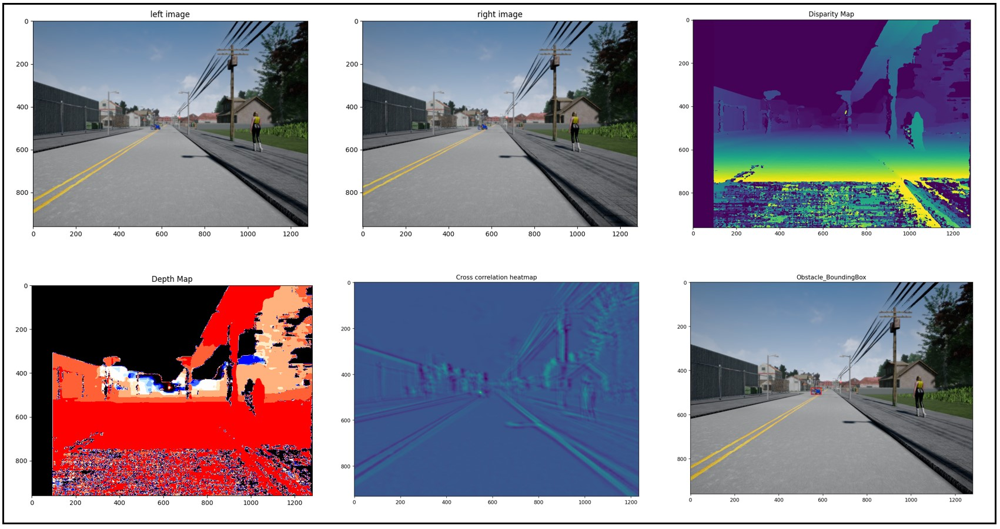

# Stereo-Depth

This code implements a stereo vision pipeline to calculate the depth of an object in an image. 

### Dependencies

This code requires the following Python libraries:

* OpenCV
* NumPy
* Matplotlib

### Running the Code

1. Clone this repository.
2. Navigate to the project directory in your terminal.
3. Install the required libraries using the following command:

```bash
pip install opencv-python numpy matplotlib
```

4. Run the script using the following command:

```bash
python stereoDepth.py
```

### Description

The code performs the following steps:

1. **Reads the stereo image pair:** It reads the left and right images from a specified file path.
2. **Displays the stereo image pair:** It displays the left and right images side-by-side using matplotlib.
3. **Reads the calibration matrices:** It reads the pre-computed camera calibration matrices for the left and right cameras.
4. **Computes the disparity map:** It computes the disparity map between the left and right images using the SGBM algorithm from OpenCV.
5. **Decomposes the projection matrices:** It decomposes the projection matrices to obtain the intrinsic and extrinsic camera parameters.
6. **Calculates the depth map:** It calculates the depth map from the disparity map, camera calibration parameters, and baseline distance between the cameras.
7. **Reads the obstacle image:** It reads a reference image of the obstacle to be detected.
8. **Locates the obstacle in the image:** It uses template matching to locate the obstacle in the left image.
9. **Calculates the nearest point:** It calculates the closest point on the obstacle to the camera based on the depth map and obstacle location.
10. **Displays the results:** It displays the depth map, bounding box around the detected obstacle, and the depth of the nearest point on the obstacle.

### File Descriptions

* `stereoDepth.py`: This is the main script that executes the stereo vision pipeline.
* `files_management.py`: This file contains functions to read the images and calibration matrices.
* `algo_defs.py`: This file contains functions to compute the disparity map, decompose the projection matrices, calculate the depth map, locate the obstacle in the image, and calculate the nearest point.

### Results

<div align="center">
<br><br>
</div>


